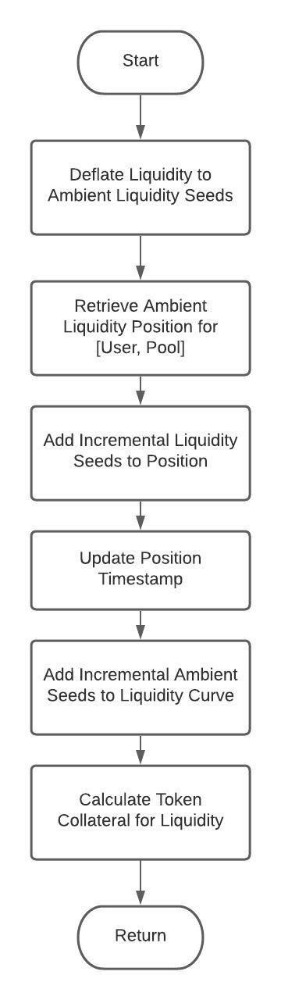
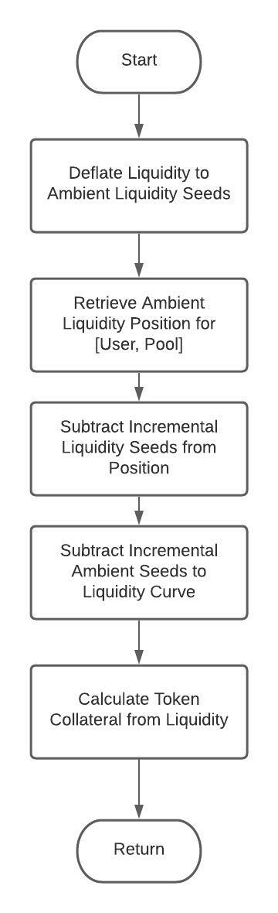
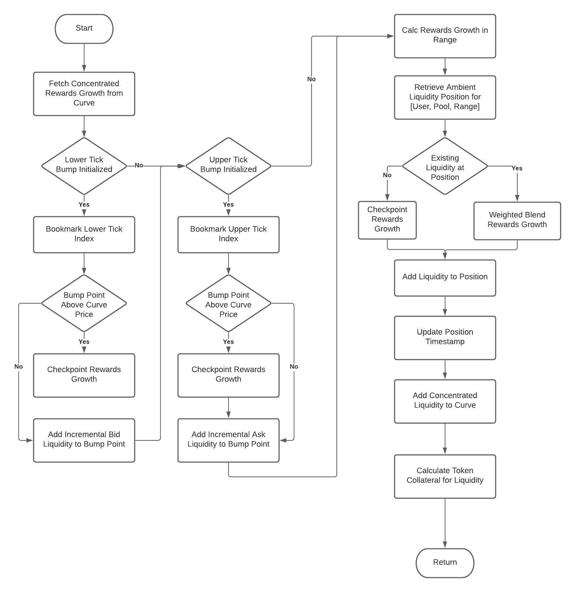
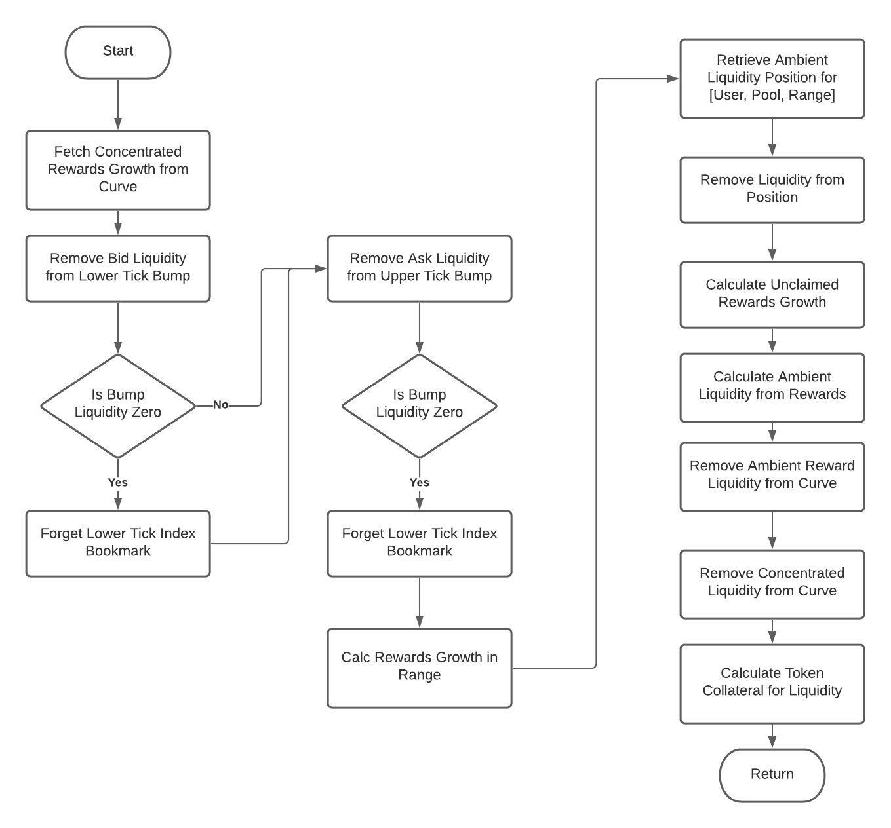
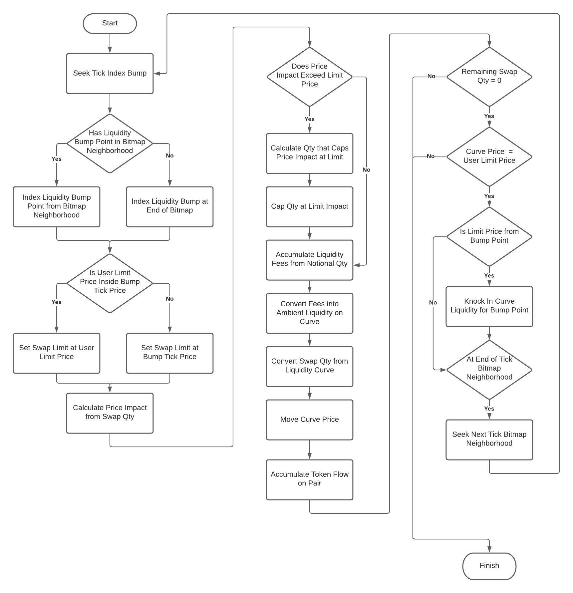

# Control Flow Charts

This document contains flow chart visualizations for the common tradable operations on CrocSwap.

CrocSwap provides two different facilities for executing tradable actions
* *Long-Form Orders* - Lets users specify an arbitrary sequence of mints, burns, and swaps across an arbitrary number of pairs and pool types.
* *Simple Orders* - Gas-efficient way to execute a single tradable action-- mint, burn or swap-- on a single pool within a single pair.

## Long Form Orders

Long-form orders are called by the user encoding a full order directive. (see [Encoding Guide](./Encoding.md)). The CrocSwap smart contract
is called with the encoded directive using the `trade()` method. The below flowchart illustrates the control flow of the code that's executed
within this method call:

The above flow chart describes the outer loop of processing the order. That includes parsing the encoded directive, accumulating the token
and Ethereum flow, settling collateral between the user and exchange, chaining a sequence of pairs, and iterating through the pool types specified
within each pair.

The inner loop of executing the pool-specific directive within each individual pool from the order directive is illustrated below:

## Simple Orders

Simple orders only specify a single tradable action within a single pair on a single pool. For mint and burn actions the call is encoded using the
`tradeWarm()` method, and for swaps its called directly with the `swap()` contract method. To reduce gas spend the code logic in these call paths
are substantially simpler and exposes less overall functionality.

The below chart illustrates the common control flow for these simple order calls:

## Tradable Actions

The above flowcharts illustrate the control flow associated with handling top-level user calls, settling flows, loading liquidity curves associated
with individual pools, then correctly applying the user specified trade action. This section illustrates how those individual tradable actions are
actually executed within a pre-loaded liquidity curve.

### Ambient Mints & Burns

Ambient liquidity positions represent liquidity that's active at every price point along the curve. Because this liquidity never goes in or out of
range there's less gas cost associated with these actions, and external staking contracts can be guaranteed that these positions continuously add
liquidity across their entire lifetime.

A mint action is when the user adds liquidity to the pool by creating a new position or increasing the liquidity in a previous position:

A burn action is when the user removes liquidity from the pool by deleting or decreasing the liquidity in a previously existing position:

### Range Concentrated Mints & Burns

Range concentrated liquidity positions are only active within an arbitrary user-specified price range. This gives the user control over when and where
their position adds liquidity, and increases capital efficiency by removing the need for supporting collateral outside the price range.

A mint occurs when the user adds range liquidity by creating a new position or increasing the liquidity in a previous position:

A burn occurs when the user removes range liquidity by deleting or decreasing the liquidity in a previously existing position:

### Swaps

A swap occurs within a liquidity curve when one token is converted to the token from the opposite side. This adjusting the price within the invariant of the AMM,
knocking liquidity in or out depending on the range-bound LPs whose boundaries were crossed, and assimilating the associated liquidity fees into the curve:

