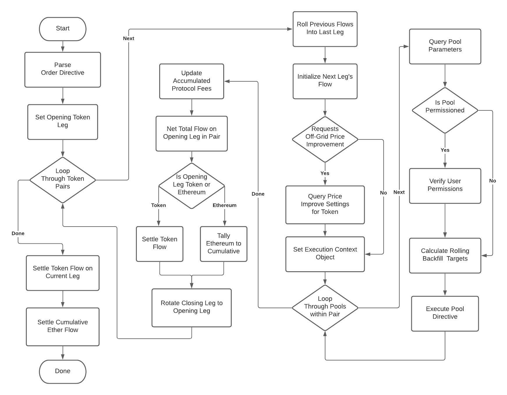
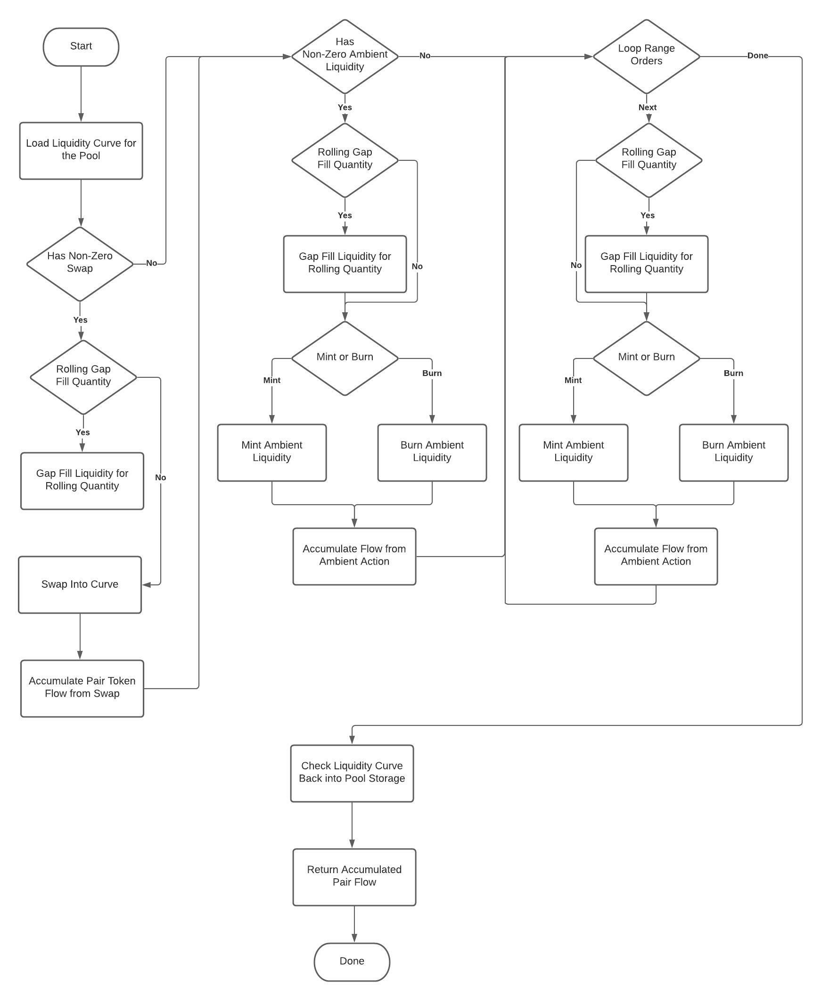
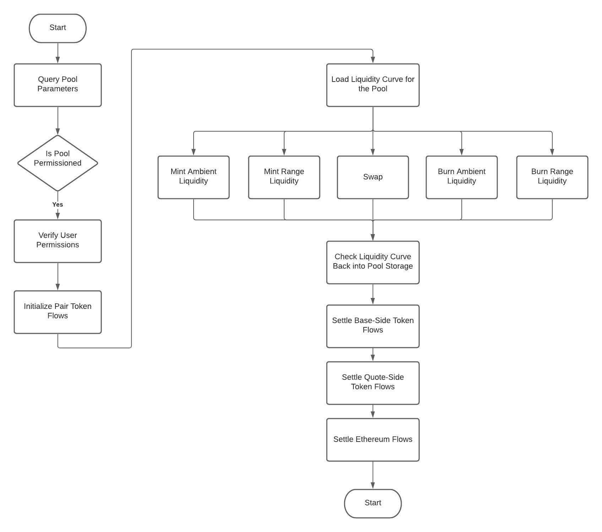

# Control Flow Charts

This document contains flow chart visualizations for the common tradable operations on CrocSwap.

CrocSwap provides two different facilities for executing tradable actions
* *Long-Form Orders* - Lets users specify an arbitrary sequence of mints, burns, and swaps across an arbitrary number of pairs and pool types.
* *Simple Orders* - Gas-efficient way to execute a single tradable action-- mint, burn or swap-- on a single pool within a single pair.

## Long Form Orders

Long-form orders are called by the user encoding a full order directive. (see [Encoding Guide](./Encoding.md)). The CrocSwap smart contract
is called with the encoded directive using the `trade()` method. The below flowchart illustrates the control flow of the code that's executed
within this method call:

The above flow chart describes the outer loop of processing the order. That includes parsing the encoded directive, accumulating the token
and Ethereum flow, settling collateral between the user and exchange, chaining a sequence of pairs, and iterating through the pool types specified
within each pair.

The inner loop of executing the pool-specific directive within each individual pool from the order directive is illustrated below:

## Simple Orders

Simple orders only specify a single tradable action within a single pair on a single pool. For mint and burn actions the call is encoded using the
`tradeWarm()` method, and for swaps its called directly with the `swap()` contract method. To reduce gas spend the code logic in these call paths
are substantially simpler and exposes less overall functionality.

The below chart illustrates the common control flow for these simple order calls:

