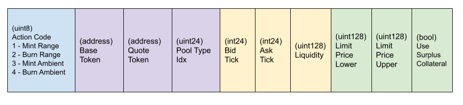

# Encoding Public Calls

To optimize gas, certain public CrocSwap methods do not rely on Solidity native encoding. Clients calling these functions must directly encode a byte string
based on specification described here. CrocSwap will also make available a TypeScript based SDK to support client-side encoding.

This "special encoding" applies to three public methods on the `CrocSwapDex` contract:

* `tradeWarm(bytes)`: Apples a single, simple, gas-optimized, atomic trading actions within a single pool
* `trade(bytes)`: Applies an arbitrary complex compound order directive across potentially multiple pairs and pools.
* `protocolCmd(bytes)`: Consolidates another of administrative commands that belong to the protocol authority.

## tradeWarm() Method Call

The input argument for this method uses a simple binary encoding of a fixed number of fields. The layout for the argument encoding is below:

Details for these fields:
* Action code: Code specifying the atomic trade action for the call. (Note that swap() is a dedicated call for gas optimization purposes.)
* Base token: Base side token speciying the pair.
* Quote token: Quote side token specifying the pair.
* Pool type index: The index of the pool type to use.
* Bid tick: The price tick of the lower boundary (only applicate for range orders)
* Ask tick: The price tick of the upper boundary (only applicate for range orders)
* Liquidity: The amount of liquidity to be added or removed
* Limit price lower: The threshold price below which the transaction will be aborted
* Limit price upper: The threshold price above which the transaction will be aborted
* Use surplus collateral: Flag indicating whether the user wants to settle with the surplus collateral they hold at the exchange.

For certain command types some of those fields may not be relevant, in which case the value of those fields are ignored. Regardless of the type of the field, all
field slots are big-Endian, occupy 32 bytes and are padded with zeros. Therefore the encoded byte string is equivalent to calling abi.encode on the field arguments.

## trade() Method Call

The input argument for this method is a binary encoding, but with several nested variable length array fields. Each array field is preceded by a count field that
must allign with the number of elements in the array. The nested structure is visualized below. 

(In the above and following diagrams all primitive type fields are marked with their Solidity type and byte size.)

The base layer order directive is composed of the following sub-fields:

* Settlement directive (opening): The user directive for settling collateral related to flows in the first token of the first pair.
* Hop directives array: An array of directives, constituting a chain of hops, each corresponding to a sequence of overlapping pairs.

Each hop directive is composed of the following sub-fields:
* Pool directives array: An array of one or more directives, each corresponding to a set of tradable actions to take place on a single liquidity pool type within the pair.
* Settlement directive: The user directive for settling related to flows in the second token of the pair. Along with the previous settlement directive (either the previous hop in the chain or the top-layer opening settlement directive), this defines the token pair over which this hop takes place on.
* Price improve flags: Flags indicating if the user is requesting off-grid price improvement and on which side.

Settlement directive field types are arranged as a composite of the following primitives:

* Token: The address of the token for this leg of the chain. (Or `0x0` for pairs with native Ethereum legs)
* Limit Qty: The user's minimal-acceptable quantity for net flows on this leg. Worse than this threshold will revert the entire transaction
* Dust threshold: The quantity threshold below which the user requests to skip the token transfer (usually to save gas on economically meaningless flows)
* Surplus collateral flag: If true, the user requests to first settle any flows using their surplus collateral balance at the exchange.

Price improve request flags constitute the following bit fields:

* Is Enabled: If true the user is requesting off-grid price improvement. (Normally disabled unless used to save on gas.)
* Use base side: If enabled the user is requesting that price improve collateral threshold is based on the base-side token in the pair. (Be aware by convention CrocSwap internally always defines the base side as the token with the lexically smaller address in the pair.)

Pool directives (visualized in the original nested diagram) are arranged as a compose of the following:

* Pool type index: Index of the pool type that the trading actions should be applied to. This index is set by the protocol and corresponds to market parameters such as fee rate, grid size, etc.
* Ambient liquidity directive: A directive defining any net mint or burn actions (if any) to take on ambient liquidity in the pool 
* Range liquidity directives: An array (possibly empty) of directives related to minting or burning concentrated liquidity range orders
* Swap directive: A directive specifying the net swap action (if any) to take on the pool
* Chaining flags: A set of flags related to how the pool chains rolling flow between pairs. 

Ambient liquidity directives are composed of the following primitive sub-fields:

* Is Add: If true indicates that this action is to mint liquidity. If false, burns liquidity.
* Liquidity: The total amount of liquidity to mint or burn. (Or zero if no action)

Swap directives are composed of the following primitive sub-fields:

* Mask: Unusued. Always set to zero.
* Flags: Bit flag field with two flags:
    * Is Buy: Indicates swap will convert base-side token to quote-side token. (By convention CrocSwap internally always defines the base side as the token with the lexically smaller address in the pair.)
    * In Base Qty: The quantity field of the swa is denominated in the pair's base-side token.
* Qty: The quantity to swap (final result could be smaller if swap hits the limit price).
* Limit Price: The worse price up to which the user is willing to trade. Note that this represents the price on the margin, for this reason the average fill price of the swap will always be better than this limit price.

Range order directives (visualized in the original nested diagram) are arranged as a composite of the following sub-fields:

* Open tick: The price tick index on one side of the range order
* Close bookend array: The reason this is an array is because it allows us to economically encode multiple range orders sharing a single boundary on one side.

Each range bookend is composed of the following:

* Close tick: The price tick index on the opposite side of the range order.
* Is Add: If true indicates that the order is minting liquidity. If false, burning.
* Liquidity: The amount of liquidity to mint/burn.

### Field Encoding

The long-form order directive contains four distinct types of fields:

* Composite fields: Composed of multiple sub-fields in a pre-determined arrangement. Composite fields can be nested.
* Arrays: Contain 0, 1 or more (up to 256) elements of the same type. 
* Primitives: A single address or value representing a specific Solidity type that can be encoded in 32 bytes or less
* Flags: One or more boolean flags that are packed bitwise into a single byte.

All array fields conform to the following structure:

Starts with a length premable: a single `uint8` byte that encodes the length of the array. If the length is zero, that's the entire field. Otherwise 
there is N sequential elements of the sub-type of the array. 

Valid primitive types are the following, along with the number of bytes they're encoded over. All primitives are big-Endian, and any bytes in excess of the 
size type should be padded with zero. Unlike Solidity's `abi.encode`, smaller types do not use a full 32 bytes to avoid needlessly bloating the transaction
data on large order directives.

* `uint8`: 1 byte
* `uint3`: 3 bytes
* `int3`: 3 bytes
* `address`: 32 bytes
* `int128`: 32 bytes
* `uint128`: 32 bytes
* `uint256`: 32 bytes
* `int256`: 32 bytes

Flags are always encoded big-endian and padded with zeros for any unused bits in the field.
