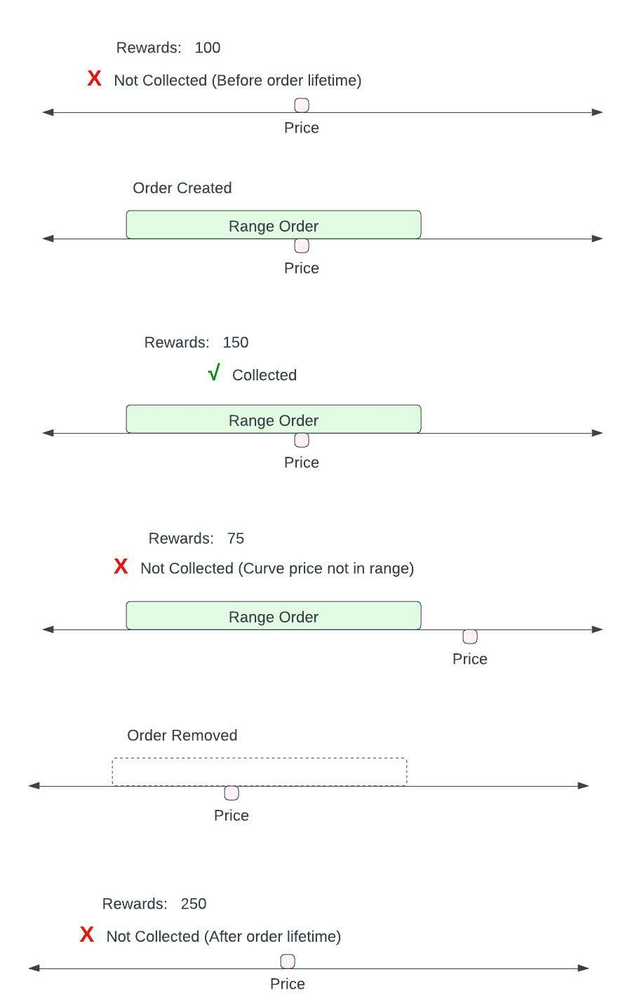
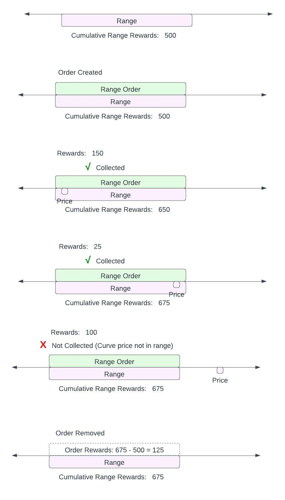
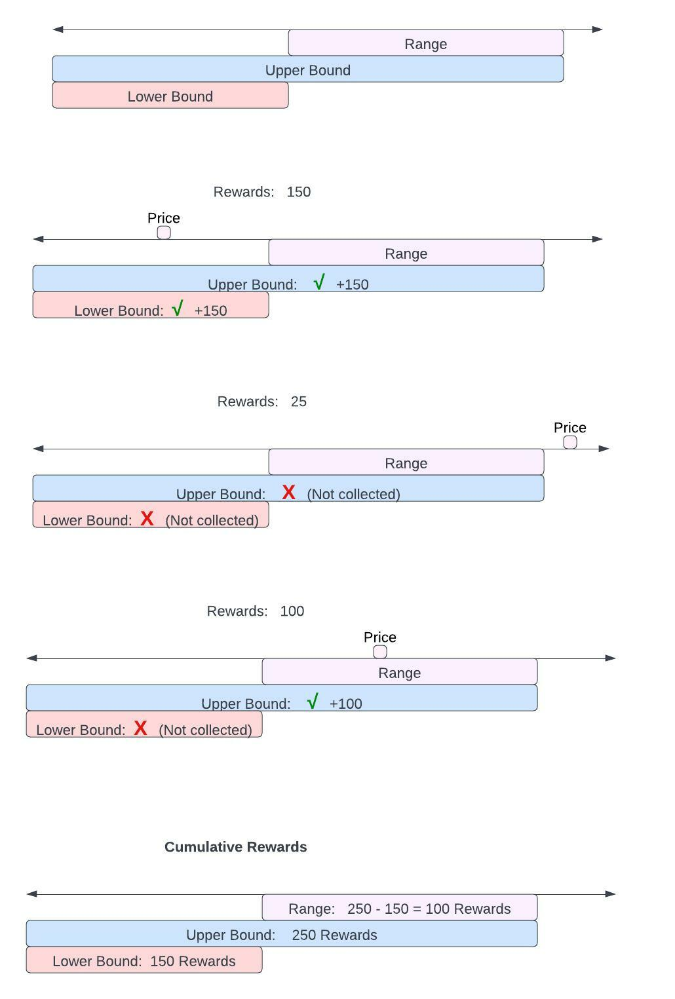
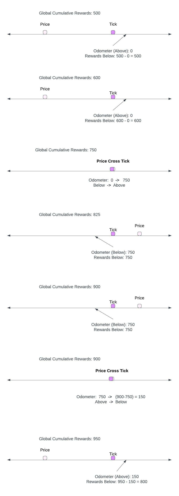

# Fee Reward Odometer Calculation

## Fee Reward Model

Calculating the accumulated rewards for a range order involves determining the cumulative rewards collected during all times the liquidity curve price was within the range during the lifetime of the order.

The below illustrates an example of how rewards would accumulate to a range order over its lifetime:

Even though the whole pool accumulated 575 units of reward during the above timeline, the range order only accumulated 150 units of reward, representing the time and price range it was active at. 

## Lifetime Range Rewards

The first step to calculating accumulated rewards for a range order is to calculate the total cumulative rewards for a specific range. Regardless of the range, an order’s accumulative rewards is simply the growth in the cumulative rewards in that range from the beginning to the end of the order’s lifetime.

The below illustrates an example of how an order’s accumulated rewards can be calculated based off the cumulative rewards for its corresponding range:

Therefore once we can track a range’s cumulative rewards over time, we can use that to assign a specific range order’s accumulated rewards over its lifetime.

## Cumulative Range Rewards

The cumulative rewards in any given range can be reduced to tracking the cumulative rewards to occur to a single side of the range boundary point. (For convention, we’ll track the cumulative rewards *below* the range boundary points.) The cumulative rewards in any single range is simply the difference between the cumulative rewards below the upper boundary and the cumulative rewards below the lower boundary.

The below illustrates an example of how this works in practice:

In the above example the cumulative rewards for the range is calculated as the cumulative rewards below the upper boundary (250) minus the cumulative rewards below the lower boundary.

## Tracking Tick Rewards

The final step is to determine how to track the cumulative rewards below any given tick boundary.  This is done by snapshotting the global cumulative *odometer* every time the curve price crosses a given active tick. 

The odometer snapshots the global cumulative rewards that occured on the opposite side of the current curve price. When the curve price is below the tick, the odometer snapshot represents the cumulative rewards that accumulated above the tick. When the price is above the tick, the odometer snapshot represents the cumulative rewards that accumulative below the tick. 

The odometer flips its snapshot every time the curve crosses the tick price. Because rewards can’t accumulate on a given side until the curve price crosses the tick, the odometer always is up to date. 

Calculating the cumulative rewards below the tick, when the curve price is below the tick just involves subtracting the up to date cumulative global rewards from the last snapshot of what the cumulative rewards above the tick were.

(By convention when a tick is first created, the odometer is setup to assume that all existing cumulative rewards occurred below the tick. Since we ultimately only care about the *change* of accumulated rewards when calculating rewards over an order lifetime, the initialization value doesn’t matter as long as it’s consistent over the lifetime of the order.)

The below illustration is an example of how the fee odometer would evolve over time as it’s crossed, and how at any give time the cumulative rewards below the tick can be calculated from the fee odometer.

